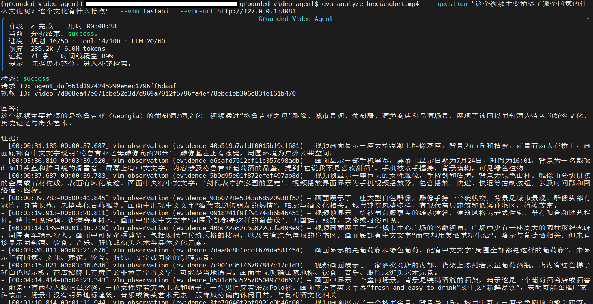

# Grounded Video Agent


An evidence-grounded multimodal agent that turns videos into searchable timelines and answers
questions with timestamped citations and exportable evidence clips.

Grounded Video Agent combines deterministic media preprocessing with an LLM-directed tool loop.
It inspects local videos, detects shots, extracts or transcribes speech, builds a searchable
timeline, retrieves multimodal evidence, and verifies claim-to-evidence links before returning an
answer.



## Features

- Deterministic media inspection, shot detection, subtitle extraction, and timeline chunking
- Embedded subtitle support with Faster Whisper ASR fallback
- Sparse, dense, and hybrid retrieval over subtitles and visual descriptions
- On-demand frame sampling, local VLM analysis, and RapidOCR screen-text recognition
- LangGraph orchestration with explicit planning, Tool, LLM, and token budgets
- Reusable, versioned artifacts managed through a per-video catalog
- Deterministic claim-to-evidence verification and timestamped citations
- Optional export of verified evidence clips
- Interactive CLI progress with text and machine-readable JSON output
- Linux Qwen3-VL/vLLM and Windows/WSL llama.cpp visual backends

## How it works

```text
Local video
    -> media inspection, shots, subtitles/ASR, chunks and indexes
    -> searchable timeline and reusable artifact catalog
    -> LangGraph planner and evidence-aware video tools
    -> local VLM/OCR analysis when visual evidence is needed
    -> deterministic claim verification
    -> grounded answer, timestamped citations and optional evidence clips
```

Media processing is deterministic and framework-independent. The LLM never receives raw video
files or local paths; it selects high-level tools whose inputs are validated by the runtime. Heavy
media data is passed between components as typed artifact and manifest references.

## Quick start

### Requirements

- Python 3.11 or newer
- FFmpeg and FFprobe
- A DeepSeek API key
- A running visual backend for questions that require image understanding
- An NVIDIA GPU is recommended for Qwen3-VL and faster ASR, but preprocessing can run on CPU

### 1. Install

<details>
<summary><strong>Show the Conda and pip installation commands</strong></summary>

Run these commands from the repository root. The PyTorch command targets CUDA 12.6; select the
wheel matching your environment when using another CUDA version or CPU-only execution.

```bash
conda create -n grounded-video-agent python=3.11
conda activate grounded-video-agent
conda install -c conda-forge ffmpeg -y

python -m pip install --upgrade pip setuptools wheel
python -m pip install torch==2.11.0 --index-url https://download.pytorch.org/whl/cu126
python -m pip install \
  numpy pillow rich \
  "scenedetect[opencv]==0.7.1" faster-whisper==1.2.1 \
  sentence-transformers==5.6.1 \
  rapidocr==3.9.2 onnxruntime==1.28.0
python -m pip install \
  langgraph==1.2.10 pydantic python-dotenv httpx \
  "fastapi[standard]==0.141.1"
python -m pip install -e .
```

Verify the Python and CUDA environment:

```bash
python -c "import torch; print('torch:', torch.__version__); print('cuda:', torch.version.cuda); print('available:', torch.cuda.is_available()); print('device:', torch.cuda.get_device_name(0) if torch.cuda.is_available() else 'CPU')"
```

</details>

### 2. Configure

Copy the environment template and add your DeepSeek API key:

```bash
cp .env.example .env
```

```dotenv
DEEPSEEK_API_KEY=your_api_key
GVA_INPUT_ROOT=analyzed_video
GVA_ARTIFACT_ROOT=artifacts
```

The default visual backend is the Linux FastAPI adapter at `http://127.0.0.1:8081`. See
[Visual model backends](#visual-model-backends) before running a visual question.

### 3. Add a video

Place the source video directly inside the tracked input directory. Only the directory marker is
committed; videos placed here remain ignored by Git.

```bash
cp /path/to/video.mp4 analyzed_video/video.mp4
```

The CLI intentionally accepts a plain filename rather than an arbitrary path:

```bash
gva doctor --vlm fastapi --vlm-url http://127.0.0.1:8081

gva analyze video.mp4 \
  --question "What happens in this video?" \
  --vlm fastapi \
  --vlm-url http://127.0.0.1:8081
```

For a transcript-only first run without a visual service:

```bash
gva analyze video.mp4 \
  --question "What is discussed in this video?" \
  --vlm off
```

## Visual model backends

The Agent keeps raw frames local and supports two interchangeable visual backends. OCR is also
local and remains opt-in.

| Backend | Recommended environment | Endpoint |
|---|---|---|
| FastAPI adapter + vLLM + Qwen3-VL | Linux with an NVIDIA GPU | `http://127.0.0.1:8081` |
| llama.cpp + Qwen3-VL GGUF | Windows with WSL | `http://<windows-host>:8080` |
| Off | Transcript-only analysis | None |

<details>
<summary><strong>Linux: Qwen3-VL with Docker, vLLM and the FastAPI adapter</strong></summary>

The verified Linux deployment keeps three processes separate:

```text
Grounded Video Agent -> FastAPI visual adapter :8081 -> vLLM :8000 -> NVIDIA GPU
```

Install Docker Engine and NVIDIA Container Toolkit using their current official instructions:

- [Docker Engine on Ubuntu](https://docs.docker.com/engine/install/ubuntu/)
- [NVIDIA Container Toolkit](https://docs.nvidia.com/datacenter/cloud-native/container-toolkit/latest/install-guide.html)
- [vLLM Docker deployment](https://docs.vllm.ai/en/latest/deployment/docker/)

Verify GPU access from both the host and Docker:

```bash
nvidia-smi
sudo docker run --rm --runtime=nvidia --gpus all ubuntu nvidia-smi
```

The deployment tested for this project uses an R580-or-newer driver and the CUDA 12.9 image from
the patched vLLM 0.19 line. The host does not need a matching CUDA Toolkit because the container
provides its CUDA user-space runtime.

Start Qwen3-VL with one concurrent sequence and conservative GPU memory usage:

```bash
sudo mkdir -p /srv/gva-cache/huggingface /srv/gva-cache/vllm

sudo docker run -d \
  --name qwen3-vl-vllm \
  --restart unless-stopped \
  --gpus '"device=0"' \
  --ipc=host \
  -p 127.0.0.1:8000:8000 \
  -v /srv/gva-cache/huggingface:/root/.cache/huggingface \
  -v /srv/gva-cache/vllm:/root/.cache/vllm \
  vllm/vllm-openai:v0.19.1 \
  --model Qwen/Qwen3-VL-4B-Instruct \
  --served-model-name qwen3-vl-4b \
  --dtype auto \
  --max-model-len 8192 \
  --gpu-memory-utilization 0.70 \
  --max-num-seqs 1 \
  --limit-mm-per-prompt.image 4 \
  --generation-config vllm
```

Monitor and verify vLLM:

```bash
sudo docker logs -f qwen3-vl-vllm
curl http://127.0.0.1:8000/health
curl http://127.0.0.1:8000/v1/models
```

Configure the project adapter in `.env`. The Agent and adapter must resolve `artifacts/` to the
same absolute path.

```dotenv
GVA_ARTIFACT_ROOT=/srv/grounded-video-agent-data/artifacts
GVA_VLM_BACKEND=fastapi
GVA_FASTAPI_VLM_BASE_URL=http://127.0.0.1:8081

GVA_VLM_ALLOWED_ROOTS=/srv/grounded-video-agent-data/artifacts
GVA_VLLM_BASE_URL=http://127.0.0.1:8000
GVA_VLLM_MODEL_ID=qwen3-vl-4b
GVA_VLLM_CONTEXT_LENGTH=8192
GVA_VLLM_MAX_FRAMES_PER_TARGET=4
GVA_VLLM_MAX_IMAGE_EDGE=1536
```

Start exactly one adapter worker because visual inference is intentionally serialized:

```bash
python -m uvicorn \
  grounded_video_agent.services.visual_model_api.runtime:create_app_from_env \
  --factory \
  --env-file .env \
  --host 127.0.0.1 \
  --port 8081 \
  --workers 1
```

Verify the complete visual path without making a paid DeepSeek request:

```bash
curl http://127.0.0.1:8081/health
gva doctor --vlm fastapi --vlm-url http://127.0.0.1:8081
```

Do not expose the unauthenticated vLLM port publicly. Keep it on loopback and use a private VPN or
an authenticated TLS reverse proxy if the service must be reached from another machine.

</details>

<details>
<summary><strong>Windows/WSL: Qwen3-VL with llama.cpp</strong></summary>

Run llama.cpp on Windows and call it from the Agent in WSL:

```powershell
winget install llama.cpp
llama-server -hf Qwen/Qwen3-VL-4B-Instruct-GGUF:Q4_K_M `
  --host 0.0.0.0 `
  --port 8080 `
  --ctx-size 8192 `
  --n-gpu-layers 99
```

Point WSL at the Windows host address:

```dotenv
GVA_VLM_BACKEND=llama-cpp
GVA_LLAMA_CPP_BASE_URL=http://<windows-host>:8080
```

```bash
gva doctor --vlm llama-cpp --vlm-url http://<windows-host>:8080
gva analyze video.mp4 \
  --question "What happens in this video?" \
  --vlm llama-cpp \
  --vlm-url http://<windows-host>:8080
```

</details>

## CLI usage

The CLI is the primary public interface. It reports bounded progress on standard error while
keeping JSON output machine-readable on standard output.

```bash
# Compact interactive progress is selected automatically in a terminal.
gva analyze video.mp4 -q "What happens in this video?"

# Save machine-readable results.
gva analyze video.mp4 -q "Summarize this video." \
  --format json \
  --output result.json

# Request verified evidence clips.
gva analyze video.mp4 -q "What happened before the door opened?" \
  --evidence-clip

# Rebuild preprocessing instead of reusing catalog artifacts.
gva analyze video.mp4 -q "What happens in this video?" \
  --force-refresh
```

Progress can be selected explicitly:

```bash
gva analyze video.mp4 -q "What happens?" --progress compact
gva analyze video.mp4 -q "What happens?" --progress verbose
gva analyze video.mp4 -q "What happens?" --progress off
```

The default long-video ceilings are 50 planning iterations, 100 Tool calls, 60 reasoning-LLM
calls, and 6,000,000 cumulative tokens. A planning completion may use up to 12,000 output tokens;
final answer generation may use up to 64,000. Override the task-level limits with
`--max-iterations`, `--max-tool-calls`, `--max-llm-calls`, and `--max-total-tokens`.

Run `gva --help` or `gva analyze --help` for the complete command reference. If the console entry
point is unavailable, use `python -m grounded_video_agent.cli`.

## Python API

The Agent can also be invoked through its public request and result contracts:

```python
from dotenv import load_dotenv

from grounded_video_agent.agent import AgentRequest, build_local_video_agent
from grounded_video_agent.infrastructure.llm import DeepSeekLLMBackend

load_dotenv()

agent = build_local_video_agent(DeepSeekLLMBackend())
result = agent.invoke(
    AgentRequest(
        filename="video.mp4",
        question="What happens in this video?",
        evidence_clip_requested=False,
    )
)
print(result.to_json())
```

Framework-independent capabilities, the preprocessing pipeline, ArtifactCatalog, and video Tool
suite are also public Python modules. Their contracts use immutable domain types and artifact
references rather than raw media objects.

## Configuration

Command-line arguments override `.env`, and `.env` overrides built-in defaults. See
[`.env.example`](.env.example) for every supported setting.

| Variable | Purpose | Default |
|---|---|---|
| `DEEPSEEK_API_KEY` | DeepSeek API credential | Required |
| `GVA_INPUT_ROOT` | Directory containing source videos | `analyzed_video` |
| `GVA_ARTIFACT_ROOT` | Generated manifests, frames, indexes, and clips | `artifacts` |
| `GVA_DEEPSEEK_MODEL` | Reasoning model | `deepseek-v4-flash` |
| `GVA_VLM_BACKEND` | `fastapi`, `llama-cpp`, or `off` | `fastapi` |
| `GVA_FASTAPI_VLM_BASE_URL` | Linux visual adapter endpoint | `http://127.0.0.1:8081` |
| `GVA_LLAMA_CPP_BASE_URL` | Windows/WSL llama.cpp endpoint | `http://127.0.0.1:8080` |
| `GVA_OCR_BACKEND` | `rapidocr` or `off` | `off` |

Never commit `.env` or API credentials.

## Privacy and security

- Source videos, audio, frames, OCR, visual-model requests, and generated clips stay in the local
  workspace when using the documented local VLM/OCR backends.
- Retrieved evidence summaries and prompts are sent to the configured DeepSeek API. The current
  default setup is therefore not fully offline.
- Media-derived text is treated as untrusted evidence rather than executable instructions.
- The registrar accepts only plain filenames under the configured input root, and visual services
  enforce allowed frame roots and request limits.
- Do not expose unauthenticated model endpoints directly to the public internet.

## Development

Install development tools after completing the runtime installation:

```bash
python -m pip install pytest==9.1.1 pytest-asyncio ruff mypy pre-commit
```

Run the local checks from the repository root:

```bash
python -m pytest -q
python -m ruff check src tests pyproject.toml
python -m mypy src tests
```

Real DeepSeek, media, and Agent integration tests are opt-in because they require local videos,
model services, or paid API access. User videos and generated artifacts are intentionally excluded
from version control.

## Current limitations

- DeepSeek is currently the only implemented reasoning-LLM provider.
- Full visual analysis requires a separately deployed Qwen3-VL service.
- ASR accuracy depends on language, audio quality, model size, and available compute.
- Long or visually dense videos may require substantial VLM time and LLM tokens.
- The default LangGraph checkpointer is in memory; durable cross-process resume is not yet enabled.
- The project currently provides a CLI and Python API rather than a Web UI.

## Roadmap

- Improve long-video evidence compression and completion recovery
- Add more reasoning-LLM and visual-model backends
- Add durable Agent checkpoints and resumable runs
- Build evaluation datasets for retrieval, grounding, and citation quality
- Add an optional Web interface

## License

Licensed under the [Apache License 2.0](LICENSE).
